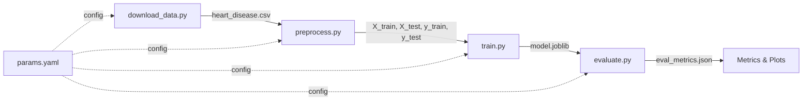

# Heart Disease Prediction — DVC Pipeline Lab

A reproducible ML pipeline for predicting heart disease, built with **DVC (Data Version Control)** to track data versions, model experiments, and evaluation metrics across the full lifecycle.

## Why DVC?

In real ML projects, data changes constantly — new patient records arrive, features get engineered, labels get corrected. Without version control for data and models, it's impossible to reproduce past experiments or understand what changed. DVC solves this by treating data and models like code: every version is tracked, every experiment is reproducible, and switching between versions is a single command.

## Project Structure

```
dvc-lab/
├── dvc.yaml                # Pipeline stage definitions
├── params.yaml             # Hyperparameters & config (experiment knobs)
├── requirements.txt
├── setup.sh                # One-command project setup
├── run_experiments.sh      # Run & compare multiple experiments
├── src/
│   ├── download_data.py    # Stage 1: Fetch UCI Heart Disease dataset
│   ├── preprocess.py       # Stage 2: Clean, scale, split
│   ├── train.py            # Stage 3: Train configurable classifier
│   ├── evaluate.py         # Stage 4: Metrics, confusion matrix, plots
│   └── version_data.py     # Data versioning demo (v1/v2/v3)
├── data/
│   ├── raw/                # Raw dataset (DVC-tracked)
│   └── processed/          # Preprocessed splits (DVC-tracked)
├── models/                 # Trained model artifacts (DVC-tracked)
├── metrics/                # Evaluation results (JSON + plots)
└── .github/workflows/
    └── dvc_pipeline.yml    # CI/CD: auto-run pipeline on push
```

## Pipeline Architecture

The DVC pipeline has four stages, each with explicit dependencies so DVC knows exactly what to re-run when something changes:



If you change a hyperparameter in `params.yaml`, DVC only re-runs the affected stages. Change the data? Everything downstream re-runs automatically.

## Quick Start

### 1. Setup

```bash
git clone <your-repo-url>
cd dvc-lab
chmod +x setup.sh run_experiments.sh
./setup.sh
source venv/bin/activate
```

This creates a virtual environment, installs dependencies, initializes Git + DVC, and configures a local remote.

### 2. Run the Pipeline

```bash
dvc repro
```

DVC executes all four stages in order: download → preprocess → train → evaluate.

### 3. View Results

```bash
dvc metrics show
cat metrics/eval_metrics.json
```

### 4. Push Data to Remote

```bash
dvc push
```

## Dataset

**UCI Heart Disease (Cleveland)** — 303 patient records with 13 clinical features predicting the presence of heart disease.

| Feature | Description |
|---------|------------|
| age | Patient age in years |
| sex | Sex (1=male, 0=female) |
| chest_pain | Chest pain type (1-4) |
| resting_bp | Resting blood pressure (mm Hg) |
| cholesterol | Serum cholesterol (mg/dl) |
| fasting_bs | Fasting blood sugar > 120 mg/dl |
| max_hr | Maximum heart rate achieved |
| exercise_angina | Exercise-induced angina |
| oldpeak | ST depression from exercise |
| slope | Peak exercise ST segment slope |
| ca | Major vessels colored by fluoroscopy (0-3) |
| thal | Thalassemia type |
| target | Heart disease present (binary) |

## Experimenting with Different Models

The whole point of DVC pipelines is making experiments painless. Everything is controlled through `params.yaml`:

**Switch from Random Forest to Gradient Boosting:**
```yaml
# In params.yaml, change:
train:
  model_type: "gradient_boosting"    # was "random_forest"
```

Then just run:
```bash
dvc repro           # Only re-runs train + evaluate (not download/preprocess)
dvc metrics show    # See new results
```

**Compare experiments:**
```bash
dvc metrics diff HEAD~1    # Compare current vs previous commit
```

### Available Models

| Model | Key Params |
|-------|-----------|
| `random_forest` | n_estimators, max_depth, min_samples_split |
| `gradient_boosting` | n_estimators, max_depth, learning_rate, subsample |
| `logistic_regression` | C, max_iter, solver |

## Data Versioning Demo

The `version_data.py` script shows how real-world data evolves:

```bash
# V1: Original baseline data (303 records)
python src/version_data.py --version v1
dvc add data/raw/heart_disease.csv
git add data/raw/heart_disease.csv.dvc
git commit -m "Data v1: baseline"
git tag data-v1

# V2: New clinic sends 50 additional patient records (353 records)
python src/version_data.py --version v2
dvc add data/raw/heart_disease.csv
git add data/raw/heart_disease.csv.dvc
git commit -m "Data v2: added clinic records"
git tag data-v2

# V3: Feature engineering adds cardiac_reserve, chol_bp_ratio, risk_category
python src/version_data.py --version v3
dvc add data/raw/heart_disease.csv
git add data/raw/heart_disease.csv.dvc
git commit -m "Data v3: feature engineering"
git tag data-v3

# Revert to any version
git checkout data-v1 -- data/raw/heart_disease.csv.dvc
dvc checkout
```

Each version gets a unique hash in the `.dvc` file. Git tracks the metadata while DVC tracks the actual data files in remote storage.

## Switching to Google Cloud Storage

The project ships with a local remote, but switching to GCS is straightforward:

```bash
# 1. Create a GCS bucket
# 2. Download service account credentials JSON
# 3. Configure DVC:
dvc remote add -d gcs_remote gs://YOUR_BUCKET_NAME
dvc remote modify gcs_remote credentialpath /path/to/credentials.json

# 4. Push existing data
dvc push
```

## CI/CD Pipeline

The GitHub Actions workflow (`.github/workflows/dvc_pipeline.yml`) runs on every push to `main`:

1. Installs dependencies
2. Runs `dvc repro` to execute the full pipeline
3. Validates that accuracy ≥ 70% and F1 ≥ 65%
4. Uploads metrics, plots, and model as GitHub artifacts

This catches data or code regressions before they hit production.

## Key DVC Commands Reference

| Command | What It Does |
|---------|-------------|
| `dvc init` | Initialize DVC in a Git repo |
| `dvc repro` | Reproduce the pipeline (smart caching) |
| `dvc push` | Push tracked data/models to remote |
| `dvc pull` | Pull tracked data/models from remote |
| `dvc add <file>` | Start tracking a file with DVC |
| `dvc checkout` | Restore data files to match current Git commit |
| `dvc metrics show` | Display evaluation metrics |
| `dvc metrics diff` | Compare metrics between commits/tags |
| `dvc dag` | Visualize pipeline dependency graph |
| `dvc params diff` | Compare parameter changes between commits |

## How This Differs from the Reference Lab

| Aspect | Reference Lab | This Implementation |
|--------|--------------|-------------------|
| Data tracking | Single text file | Full ML dataset with 3 versions |
| Pipeline | Manual DVC add/push | Automated `dvc.yaml` pipeline (4 stages) |
| Models | None | 3 configurable classifiers |
| Params | None | `params.yaml` with full experiment config |
| Metrics | None | JSON metrics + confusion matrix + feature importance |
| CI/CD | None | GitHub Actions with metric validation |
| Versioning demo | Edit text file | Realistic data evolution (new records, feature engineering) |
