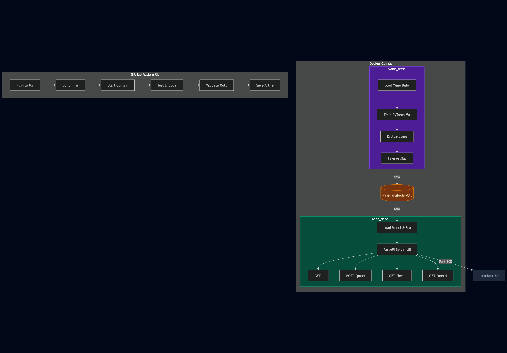

# Wine Cultivar Classifier - Docker Lab

This is my implementation of the Docker Lab for the MLOps course. Instead of following the professor's Iris + TensorFlow example, I built a wine quality classification app using PyTorch and FastAPI, containerized with Docker.

The idea is simple — train a neural network to classify wines into 3 cultivars based on their chemical properties (alcohol content, acidity, color intensity, etc.), and serve it through a web interface. The whole thing runs inside Docker containers.

## How It Works

The project uses a **multi-stage Docker build**:

- **Stage 1 (Trainer):** Installs dependencies, trains a PyTorch model on the Wine dataset, and saves the model artifacts
- **Stage 2 (Server):** Takes only the trained model from Stage 1, sets up FastAPI, and serves predictions

There's also a `docker-compose.yml` that splits this into two separate containers — one for training and one for serving — connected through a shared Docker volume.

## Architecture



<!--
I created this diagram using draw.io (https://app.diagrams.net/)
It shows:
- Docker Compose orchestrating two containers (wine_trainer and wine_serving)
- wine_trainer trains the model and saves artifacts to a shared volume
- wine_serving loads the model and runs the FastAPI server on port 8000
- The web UI is accessible at localhost:8000
-->

## How This Differs from the Reference Lab

I wanted to make this my own, so here's what I changed:

| What          | Reference Lab     | My Version                                         |
| ------------- | ----------------- | -------------------------------------------------- |
| Dataset       | Iris (4 features) | Wine (13 features)                                 |
| ML Framework  | TensorFlow/Keras  | PyTorch                                            |
| Web Framework | Flask             | FastAPI                                            |
| Model         | Simple 2-layer NN | 3-layer NN with BatchNorm, Dropout, early stopping |
| Data Split    | Train/Test        | Train/Val/Test (70/15/15)                          |
| API           | Just /predict     | /predict, /health, /metrics                        |
| Predictions   | Class label       | Class + confidence % + probability breakdown       |
| Docker        | Basic multi-stage | Multi-stage + HEALTHCHECK + .dockerignore          |
| CI/CD         | None              | GitHub Actions pipeline                            |

## Getting Started

Make sure you have [Docker Desktop](https://www.docker.com/products/docker-desktop/) installed.

### Using the Dockerfile

```sh
# Build the image (this trains the model too — takes a few minutes)
docker build -t wine-classifier:v1 .

# Run it
docker run -p 8000:8000 wine-classifier:v1
```

### Using Docker Compose

```sh
# Start everything
docker compose up

# Run in background
docker compose up -d

# Stop
docker compose down
```

Then go to **http://localhost:8000** in your browser. You can enter wine feature values manually or click "Fill sample values" to test with a real wine sample.

## API Endpoints

- `GET /` — Web UI for making predictions
- `POST /predict` — Send features, get back the predicted cultivar with confidence scores
- `GET /health` — Health check (useful for container orchestration)
- `GET /metrics` — Shows training metrics like accuracy and loss

### Quick test with curl

```sh
curl -X POST http://localhost:8000/predict \
  -H "Content-Type: application/json" \
  -d '{"features": [14.23, 1.71, 2.43, 15.6, 127, 2.80, 3.06, 0.28, 2.29, 5.64, 1.04, 3.92, 1065]}'
```

## CI/CD with GitHub Actions

I also set up a GitHub Actions workflow that triggers on every push to Main. It:

1. Builds the Docker image
2. Starts the container
3. Tests all the API endpoints automatically
4. Validates that predictions return the right format
5. Saves the Docker image as a downloadable artifact

The workflow file is at `.github/workflows/docker_ci.yml`.

## Project Structure

```
Lab2/
├── .github/workflows/
│   └── docker_ci.yml       # CI/CD pipeline
├── Dockerfile               # Multi-stage build
├── docker-compose.yml       # Two-container setup
├── .dockerignore
├── requirements.txt
├── README.md
└── src/
    ├── model_training.py    # Training script (PyTorch)
    ├── main.py              # FastAPI app
    ├── templates/
    │   └── predict.html     # Web interface
    └── statics/
        ├── wine_class0.jpg
        ├── wine_class1.jpg
        └── wine_class2.jpg
```

## Tools & Libraries

- PyTorch — model training
- FastAPI + Uvicorn — web server
- scikit-learn — preprocessing and evaluation
- Docker — containerization
- Docker Compose — multi-container orchestration
- GitHub Actions — CI/CD automation
